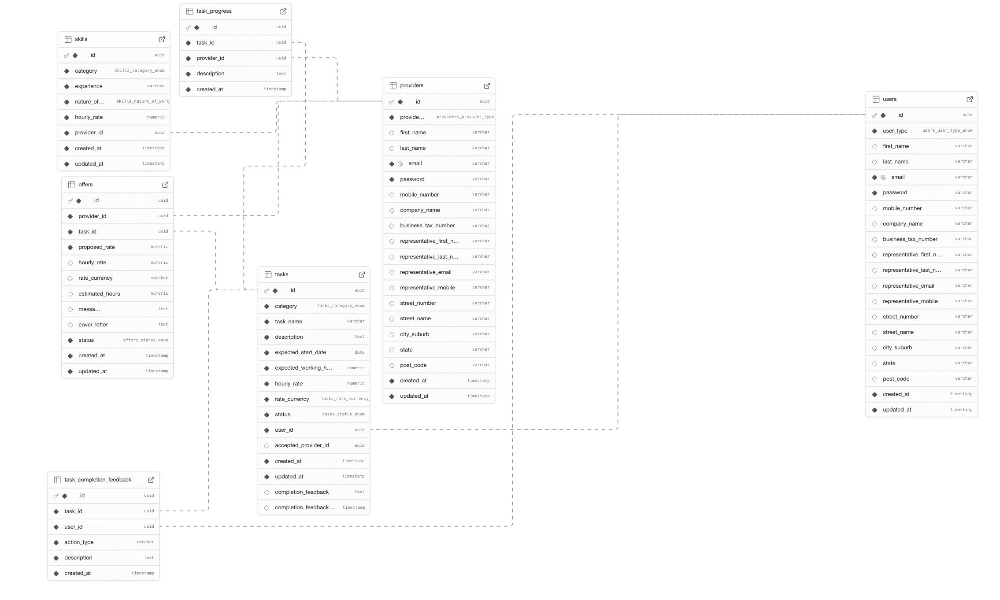

# Skill Marketplace App

A comprehensive task management and skill marketplace API built with NestJS, TypeScript, and PostgreSQL. This platform connects users who need tasks completed with skilled providers who can fulfill those needs.

## 🚀 Features

- **User & Provider Registration**: Separate registration flows for task creators and service providers
- **Task Management**: Complete lifecycle management from creation to completion
- **Skill Profiles**: Providers can showcase their expertise and capabilities
- **Offer System**: Bidding system for providers to compete for tasks
- **Progress Tracking**: Real-time progress updates with approval workflows
- **JWT Authentication**: Secure token-based authentication
- **Role-Based Access**: Fine-grained permissions for users and providers
- **Interactive API Documentation**: Comprehensive Swagger/OpenAPI documentation

## 🏗️ Technology Stack

- **Framework**: NestJS (Node.js TypeScript framework)
- **Database**: PostgreSQL with TypeORM
- **Authentication**: JWT with Passport
- **Documentation**: Swagger/OpenAPI
- **Validation**: class-validator and class-transformer
- **Security**: bcrypt for password hashing

## 📋 API Documentation

- **Swagger UI**: `GET /docs` - Interactive API documentation interface
- **OpenAPI JSON**: `GET /swagger/json` - Machine-readable API specification

## 🛠️ Installation & Setup

### Prerequisites

- Node.js (v16 or higher)
- PostgreSQL database
- npm or yarn package manager

### Quick Start

```bash
# 1. Clone the repository
git clone <repository-url>
cd skill-marketplace-app

# 2. Install dependencies
npm install

# 3. Set up environment variables
cp .env.example .env
# Edit .env file with your configuration

# 4. Start development server
npm run start:dev

# 5. Start production server
npm run start:prod
```

### Environment Variables

Create a `.env` file in the root directory with the following variables:

```env
DATABASE_HOST=localhost
DATABASE_PORT=5432
DATABASE_USERNAME=your_username
DATABASE_PASSWORD=your_password
DATABASE_NAME=skill_marketplace
JWT_SECRET=your_jwt_secret_key
PORT=4000
NODE_ENV=dev
```
## 📊 API Endpoints

### Authentication (`/auth`)

| Method | Endpoint                  | Description                               | Access |
| ------ | ------------------------- | ----------------------------------------- | ------ |
| `POST` | `/auth/register/user`     | Register as a user (task creator)         | Public |
| `POST` | `/auth/register/provider` | Register as a provider (service provider) | Public |
| `POST` | `/auth/login`             | Login and receive JWT token               | Public |

### Task Management (`/tasks`)

| Method   | Endpoint     | Description               | Access        |
| -------- | ------------ | ------------------------- | ------------- |
| `POST`   | `/tasks`     | Create a new task         | Users only    |
| `GET`    | `/tasks`     | Get tasks with filters    | Authenticated |
| `GET`    | `/tasks/:id` | Get specific task details | Authenticated |
| `PATCH`  | `/tasks/:id` | Update task information   | Users only    |
| `DELETE` | `/tasks/:id` | Delete a task             | Users only    |

#### Task Progress & Completion

| Method | Endpoint              | Description                | Access         |
| ------ | --------------------- | -------------------------- | -------------- |
| `POST` | `/tasks/:id/progress` | Update task progress       | Providers only |
| `POST` | `/tasks/:id/complete` | Submit task for completion | Providers only |
| `POST` | `/tasks/:id/accept`   | Accept task completion     | Users only     |
| `POST` | `/tasks/:id/reject`   | Reject task completion     | Users only     |
| `GET`  | `/tasks/:id/progress` | Get progress history       | Authenticated  |

### Skill Management (`/skills`)

| Method   | Endpoint            | Description                | Access         |
| -------- | ------------------- | -------------------------- | -------------- |
| `POST`   | `/skills`           | Create a new skill profile | Providers only |
| `GET`    | `/skills/my-skills` | Get own skills             | Providers only |
| `PATCH`  | `/skills/:id`       | Update skill information   | Providers only |
| `DELETE` | `/skills/:id`       | Delete a skill             | Providers only |

### Offer Management (`/offers`)

| Method   | Endpoint                 | Description                | Access         |
| -------- | ------------------------ | -------------------------- | -------------- |
| `POST`   | `/offers`                | Create an offer on a task  | Providers only |
| `GET`    | `/offers`                | Get offers with filters    | Authenticated  |
| `GET`    | `/offers/:id`            | Get specific offer details | Authenticated  |
| `GET`    | `/offers/status/:status` | Get offers by status       | Authenticated  |
| `PATCH`  | `/offers/:id`            | Update offer details       | Providers only |
| `DELETE` | `/offers/:id`            | Withdraw an offer          | Providers only |
| `PATCH`  | `/offers/:id/respond`    | Accept/reject an offer     | Users only     |

## 🔐 Authentication & Authorization

### JWT Token Usage

All protected endpoints require a JWT token in the Authorization header:

```http
Authorization: Bearer <your-jwt-token>
```

### User Roles

**Users (Task Creators)**:

- Create, update, and delete their own tasks
- Accept or reject offers on their tasks
- Accept or reject task completions
- View their posted tasks and received offers

**Providers (Service Providers)**:

- Create, update, and delete their skill profiles
- Create offers on open tasks
- Update progress on accepted tasks
- Submit tasks for completion approval
- View tasks they have offers for

## 📈 Business Logic & Workflows

### Task Lifecycle

```
OPEN → IN_PROGRESS → PENDING_APPROVAL → COMPLETED
  ↑                                         ↓
  └─────── (if completion rejected) ────────┘
```

1. **OPEN**: User creates a task
2. **IN_PROGRESS**: User accepts a provider's offer
3. **PENDING_APPROVAL**: Provider submits task for completion
4. **COMPLETED**: User accepts the completion
   - OR back to **IN_PROGRESS** if user rejects completion

### Offer Status Flow

- `pending` → Initial offer state
- `accepted` → User accepts the offer
- `rejected` → User rejects the offer
- `withdrawn` → Provider withdraws the offer
- `completion_pending_approval` → Task submitted for completion review
- `completion_accepted` → Task completion approved
- `completion_rejected` → Task completion rejected

## 🗄️ Database Schema



### Core Entities

- **User**: User account information and preferences
- **Provider**: Provider account information and service details
- **Task**: Task details, requirements, and status tracking
- **Skill**: Provider skill profiles and expertise areas
- **Offer**: Offers made by providers on tasks
- **TaskProgress**: Progress updates with timestamps
- **TaskCompletionFeedback**: Completion feedback and review history

### Key Features

- UUID primary keys for enhanced security
- Comprehensive indexing for query optimization
- Proper entity relationships and foreign keys
- Tables with `created_at`/`updated_at` timestamps

## 🐳 Docker Deployment

```bash
# Build Docker image
docker build -t skill-marketplace-app .

# Run container
docker run -p 3000:80 -e NODE_ENV=production skill-marketplace-app
```

## 🛠️ Development Guidelines

### Code Structure

```
src/
├── controllers/     # HTTP request/response handling
├── services/        # Business logic implementation
├── dto/            # Data validation and transformation
├── entities/       # Database schema definitions
├── guards/         # Authentication and authorization
├── decorators/     # Custom functionality
└── modules/        # Feature modules
```

### Key Decorators

```typescript
// Core NestJS decorators
@Controller('endpoint')     // Define API route controllers
@Injectable()              // Mark classes as injectable services
@Module()                  // Define application modules
@UseGuards()              // Apply authentication/authorization guards

// HTTP method decorators
@Get(), @Post(), @Patch(), @Delete(), @Put()

// Parameter decorators
@Body(), @Param('id'), @Query(), @Request()

// Swagger documentation
@ApiTags(), @ApiOperation(), @ApiResponse(), @ApiBearerAuth()

// Custom security
@Roles('user', 'provider'), @UseGuards(JwtAuthGuard, RolesGuard)
```
